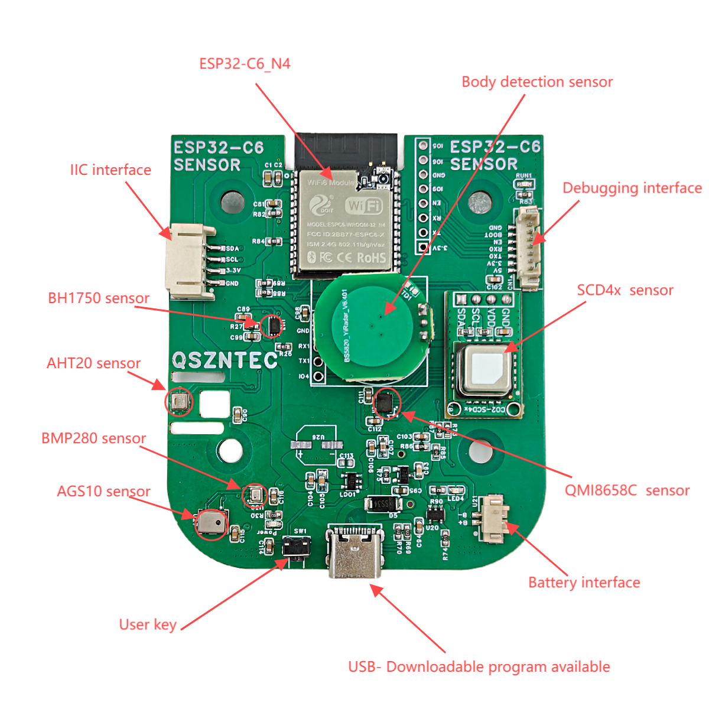

# Q_sensor

 
<a href="https://github.com/xyzroe/Q_sensor/releases"></img></a>
<a href="https://github.com/xyzroe/Q_sensor/actions/workflows/build.yml"></img></a>
<a href="https://github.com/xyzroe/Q_sensor/releases/latest"></img></a>
<a href="https://github.com/xyzroe/Q_sensor/issues"></img></a>

## Overview

Q_sensor is a multi-functional Zigbee air quality sensor that integrates various environmental sensors to provide comprehensive monitoring of air quality: temperature, humidity, pressure, CO2 level, VOC index, illuminance.

### Sensors:
- **AGS10** - VOC sensor (0x1a)
- **SCD40** - CO2 sensor (0x62) 
- **AHT20** - Temperature sensor (0x38) 
- **BH1750** - Ambient Light sensor (0x23) 
- **BMP280** - Barometric pressure sensor (0x77) 
- **QMI8658C** - 6-axis attitude gyro sensor (0x6b) 
- **BS5820** - 5.8G radar sensor (Binary)

Found something at address 0x7e?

### GPIO
- **ADC pin V1** - IO2
- **ADC pin V2** - IO0
- **Button** - IO10
- **Radar** - IO4
- **LED** - IO5
- **SDA** - IO6
- **SCL** - IO7

## zigbee2mqtt

External converter <a href=./external_converter/q.js>q.js</a>

### Features
- Almost all values use standard clusters (so it will work on any system)
- Configurable reporting
- OTA update possible
- SCD40 gets pressure data from BMP280 for more accurate readings
- All sensors read every 10 seconds
  
  
If you don't need some value - go to reporting tab and set  
`Min rep interval`, `Max rep interval` to `65534` and `Min rep change` to `0`

## Install

You can find the latest release on <a href="./releases">releases page</a> and install like any other ESP32 firmware.

## Where to buy?

[Official store](https://www.tindie.com/products/adz1122/esp32-c6-multi-sensor-co2-voc-imu/)

## License

 
This work is licensed under a <a rel="license" href="http://creativecommons.org/licenses/by-nc-sa/4.0/">Creative Commons Attribution-NonCommercial-ShareAlike 4.0 International License</a>

